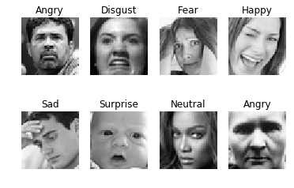
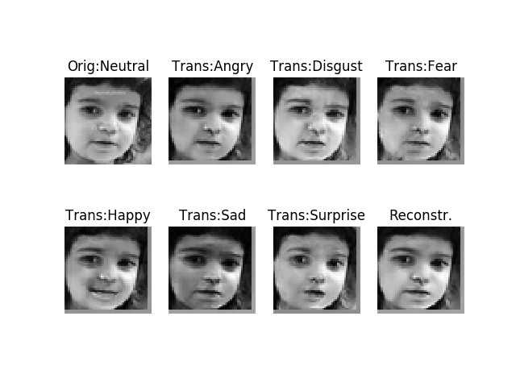
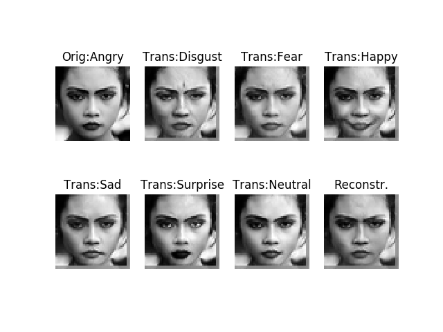
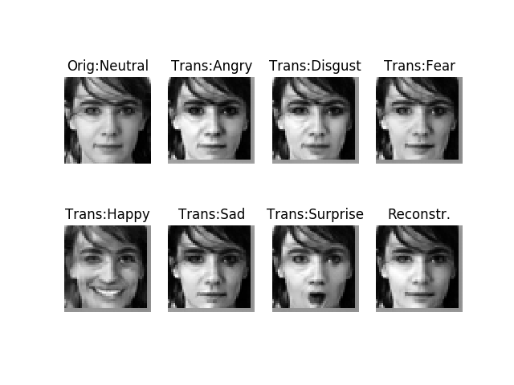
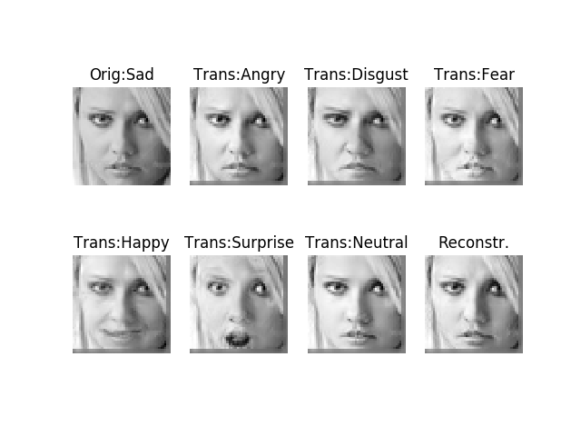
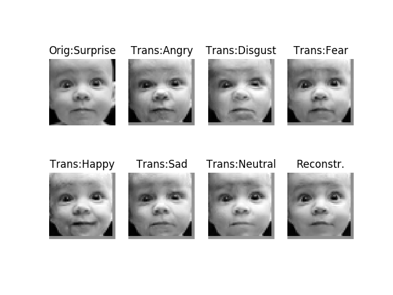
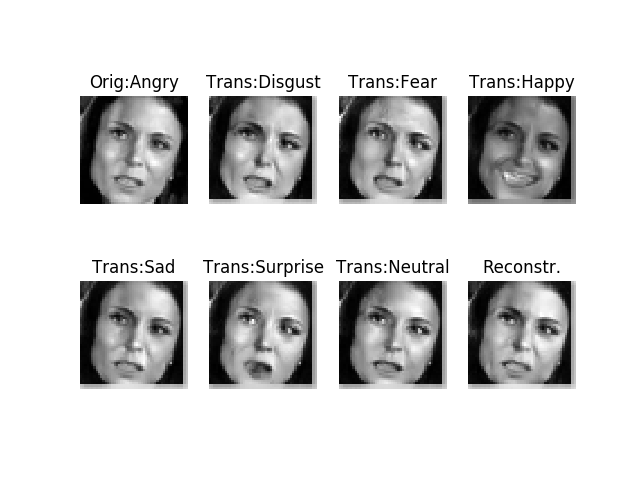
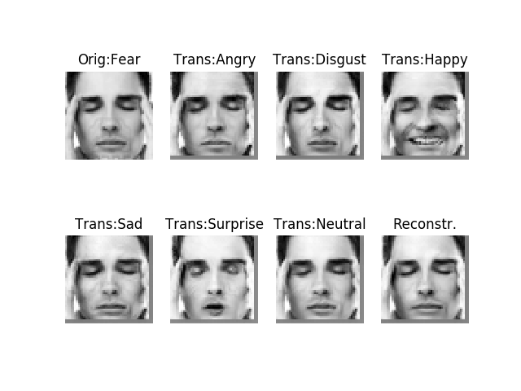
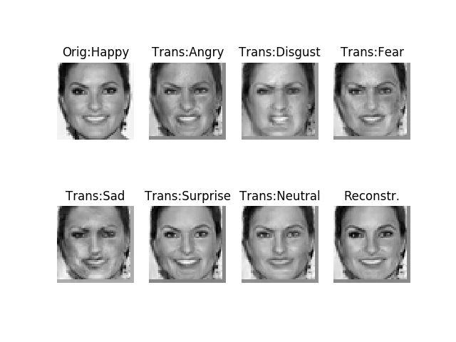
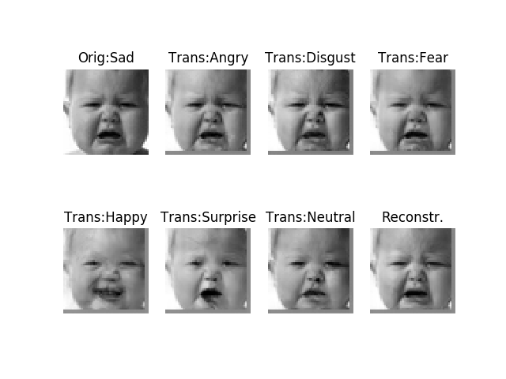

# Conditional Cycle-Consistent Generative Adversarial Networks (CCycleGAN)
Generative adversarial networks has been widely explored for generating realistic images but their capabilities in multimodal image-to-image translations where a single input may correspond to many possible outputs in a conditional generative model setting have been vaguely explored (Zhu et al., 2017). Moreover, applying such capabilities of GANs in the context of facial expression generation, where even relatively little unnatural distortions of generated images can be easily detectable by a human, to my knowledge, is a green field. Thus, the novelty of this study consists in experimenting the synthesis of facial expressions, i.e. learning to translate an image from a domain X (e.g. the face image of a person) conditioned on a given facial expression label (e.g. “joy”) to the same domain X but conditioned on a different facial expression label (e.g. “surprise”). 

**Note: this is an unpaired image-to-image translation problem.**

## Installation
    $ git https://github.com/gtesei/ccyclegan.git
    $ cd ccyclegan/
    $ sudo pip3 install -r requirements.txt

## Train
    $ python ccyclegan_t26.py
    
## Dataset 
FER2013 consists of 28,709 48x48 pixel grayscale images of faces annotated with the emotion of facial expression as one of seven categories (0=Angry, 1=Disgust, 2=Fear, 3=Happy, 4=Sad, 5=Surprise, 6=Neutral). The faces have been automatically registered so that the face is more or less centered and occupies about the same amount of space in each image.
You need to download the dataset from [Kaggle](https://www.kaggle.com/c/challenges-in-representation-learning-facial-expression-recognition-challenge/data) and put __fer2013.csv__ under the folder __datasets__. 

 

**Note: this is a dataset of unpaired images, i.e. for a given person/facial expression there are NOT other images of the same person with different facial expressions.**

## Exemplar Results 

### [T26] [Reconstruction Loss Weight = 1/2 Adversarial Loss Weight = 1/2 Facial Expression Classification Loss Weight]

 

 

### [T25/26] [Reconstruction Loss Weight = Adversarial Loss Weight = Facial Expression Classification Loss Weight ; More Stable Training Procedure (G)]

 

 

 

 

### [T24] [Reconstruction Loss Weight = Adversarial Loss Weight = Facial Expression Classification Loss Weight]

  

  

  

## Experiment Log

Id | Code | Description | Notes | 
--- | --- | --- | --- |
T1 | ccyclegan_t1.py | Baseline - GAN loss (the negative log likelihood objective) is replaced by a least-squares loss [X. Mao, Q. Li, H. Xie, R. Y. Lau, Z. Wang, and S. P. Smolley. _Least squares generative adversarial networks._ In CVPR. IEEE, 2017]. Also, we adopt the technique of [Y. Taigman, A. Polyak, and L. Wolf. _Unsupervised cross-domain image generation._ In ICLR, 2017.] and regularize the generator to be near an identity mapping when real samples of the target domain are provided as the input to the generator. Weights are the same of the paper of CycleGAN, i.e. Identity loss weight = 0.1*Cycle-consistency loss weight , G-loss = 1. | G-loss too high compared to D-loss. Let's try to increment the weight of G-loss. |
T2 | ccyclegan_t2.py | Like T1 but the G-loss weight is is set to 20 | No reconstruction in 200 epochs – discriminator has 100% accuracy  |
T3 | ccyclegan_t3.py | Like T1 but Identity loss weight is set to 0, G-loss is binary cross-entropy instead of least-squares loss  (and weight is set to 7). | G-loss too high vs. D-loss |
T4 | ccyclegan_t4.py | Let's simplify the problem: only from domain “Neutral” to domain “Happy”, and from domain “Happy” to domain “Neutral”. No other transformations. | Discriminator ~100% accuracy. This can be due to the fact that, reducing the problem in this way, also the training data is reduced and the generator does not benefit from this. This is an example of situation when Multi-task learning should be applied. Let's restore the problem to its original terms! |
T5 | ccyclegan_t5.py | Like T1 but we concatenate the label encoded after the convolutions as shown in this paper: https://arxiv.org/ftp/arxiv/papers/1708/1708.09126.pdf. Identity loss is removed. | G-loss too high vs. D-loss |
C1 | classifier.py | D of ccyclegan_t4.py | accuracy-train ~ 100%, accuracy-test ~70% which is compatible with the winner model of the Kaggle competition, i.e. 0.71161 |
T6 | ccyclegan_t6.py | Let's make G predict on train images to see if G is able to generate realistic images. | Images not very realistic. |
C2 | classifier2.py | ResNet50 pre-trained on ImageNet (RGG-images). Note: images from grayscale are transformed into RGB. | After 15 epochs we have accuracy-train ~ 95% and accuracy-test ~ 80%, which better than the winner of the Kaggle competition (ResNet was released in 2015 vs. the competition was organized in 2013) |
T7 | ccyclegan_t7.py | Let's use ResNet50 pre-trained on ImageNet as D. | Generated images not very realistic and D-accuracy~100% |
T8 | ccyclegan_t8.py | Change the training procedure removing shuffling and training D only on real given y_true samples, i.e. removing real given y_false samples. | Discriminator has ~100% accuracy on training set, reconstruction loss is low and G-loss is high compared with D-loss.  |
T9 | ccyclegan_t9.py | Let's use ResNet50 pre-trained on ImageNet as D like T7 but let's freeze it. | Generated images not very realistic and reconstruction loss is low. |
T10 | ccyclegan_t10.py | x2 GAN loss weight (G)   | No significative changes from previous model |
T11 | ccyclegan_t11.py | Class label ecoded after convolutional layers (G).     | Some enhancements. Face expressions are better. Needs to be more realistic.  |
T12 | ccyclegan_t12.py | Dropout as regularization technique.    | Not very helpful.   |
T13 | ccyclegan_t13.py | Like T11, just trained longer(300 epochs).    | Some enhancements. Face expressions are better. Needs to be more realistic.  |
T14 | ccyclegan_t14.py | Class label ecoded after convolutional layers (D).      | Not very helpful.  |
T15 | ccyclegan_t15.py | Like T14. Removed the batch of real images with wrong labels to the discriminator.      | Not very helpful.  |
T16 | ccyclegan_t16.py | Like T11. Removed the batch of real images with wrong labels to the discriminator.      | Not very helpful.  |
**T17** | **ccyclegan_t17.py** | **Generator divided into G_enc (responsible to encode image into latent space) and G_dec (responsible to decode latent vector into image)**    | **This change is conceptually correct and I have kept in following models, but results here are not very different**  |
T18 | ccyclegan_t18.py | Like T17 but with same weights for loss functions  | Results are not very different  |
T19 | ccyclegan_t19.py | Like T17 but adversarial loss (G/D) is 1/7 of facial classification loss (G/D)  | Results are not very different  |
**T20** | **ccyclegan_t20.py** | **Like T17 but added a transformation layer (concatenation of class label to latent vector + dense block + LeakyReLU block + 1x1 convolution to have the correct number of channels) between G_enc and D_dec.**  | **This change is conceptually correct and I have kept in following models, but results here are not very different**   |
**T21** | **ccyclegan_t21.py** | **Like T20 but sigmoid instead of softmax as last block for face classification (G/D)**  | **This change is conceptually correct and I have kept in following models, but results here are not very different**   |
**T22** | **ccyclegan_t22.py** | **Like T21 but during the D training for generated images created a new 0-label for fake facial expressions. The outputs from sigmoids are forced to be zero in case of fake expressions in D instead of the desired  class label. In turn, this force G to learn better as oterwise, it would be penalized twice (gan real/fake loss + gan facial expression loss)**  | **This change is conceptually correct and I have kept in following models, but results here are not very different**   |
T23 | ccyclegan_t24.py | Like T22, just trained longer (400 epochs).  | Results are not very different    |
**T24** | **ccyclegan_t22.py** | **Like T21 but training procedure of D/G significatively changed. For each sample, all the other 7-1=6 possible face expressions are generated (G) and used to train D/G.**  | **Much better results**   |
T25 | ccyclegan_t25.py | Just code refactoring and sample shuffling is added to G training.  | Still good results, perhaps even better. G loss looks better after 200 epochs (shuffling looks like to stabilize training procedure).   |
T26 | ccyclegan_t26.py | Code refactoring, experimented different combinations of Adversarial Loss Weight (G) vs. Facial Expression Classification Loss Weight (G): 1:1, 1:2, 2:1, 3:9, 10:100. Experimented lower learning rate (0.0001 vs. 0.0002). |  Confirmed best hyper-params. |

    

